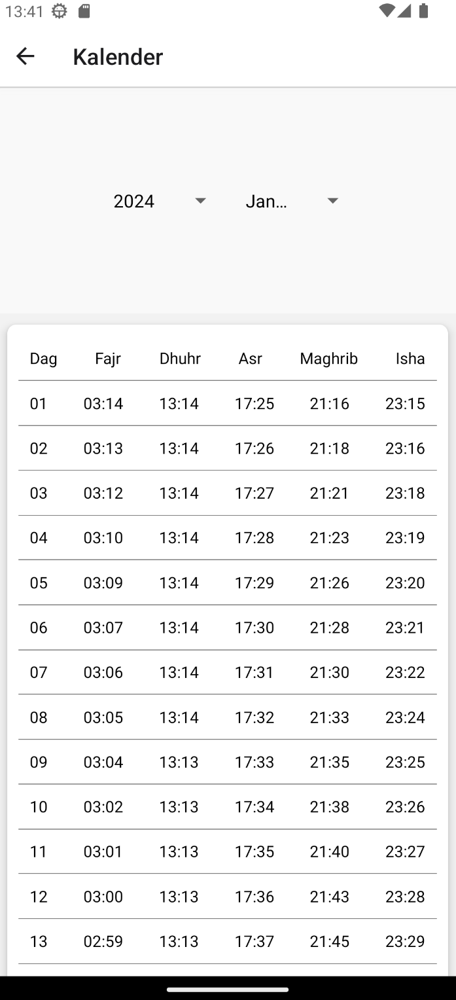
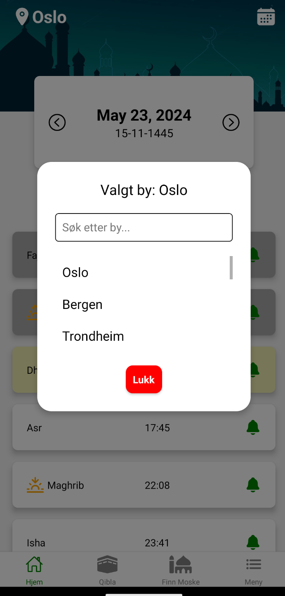
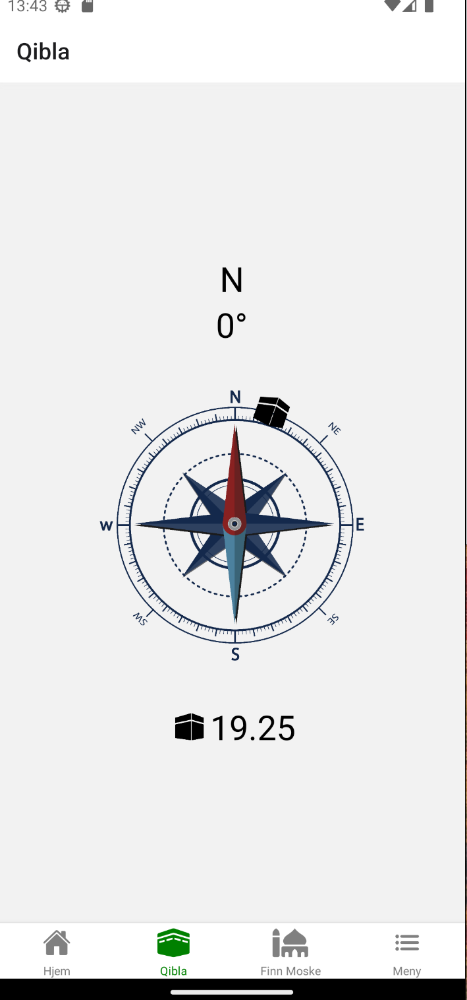
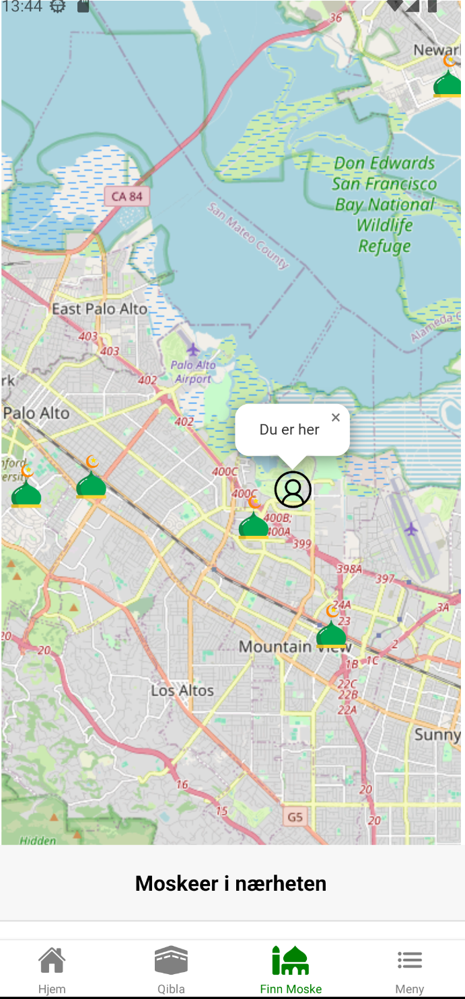
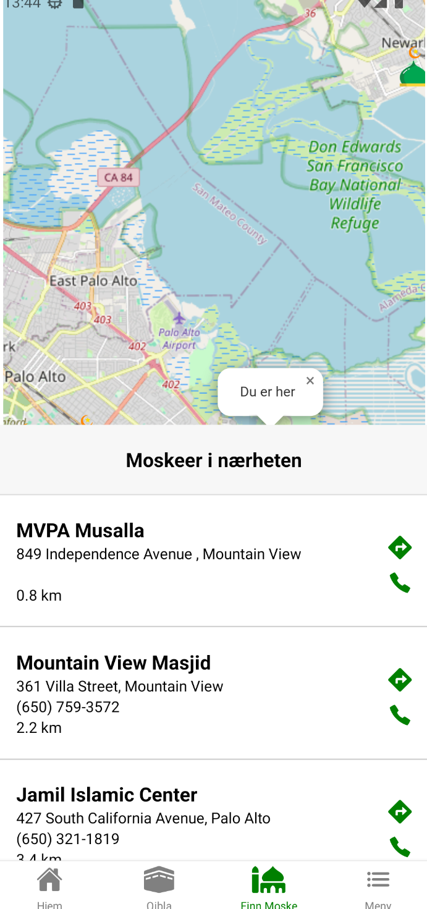

# Faithful Companion

Faithful Companion er en omfattende bønnetidsapp som hjelper muslimer med å holde oversikt over bønnetider, finne nærmeste moskeer, og mer. Appen er utviklet med React Native og Expo.

## Funksjoner
- Bønnetider basert på brukerens lokasjon
- Push-varsler for bønnetider
- Finn nærmeste moskeer på kartet
- Qibla-kompass for å finne retningen mot Mekka
- Hijri-kalender
- Les Koranen og Allah's 99 navn

## Krav
- Node.js
- Expo CLI
- Android Studio eller Xcode for å kjøre på emulator

## Installasjon
1. Klon repoet:
    ```sh
    git clone https://github.com/SaidSolsaev/prayer-times-app.git
    ```
2. Installer avhengigheter:
    ```sh
    cd prayer-times-app
    npm install
    ```
3. Start Expo:
    ```sh
    expo start
    ```

## Bruk
1. Åpne Expo Go på mobilen din.
2. Scan QR-koden som vises i terminalen eller nettleseren din etter å ha startet Expo.

## Skjermbilder
| Hjem | Kalender | Velg By | Qibla | Finn Moske | Meny |
|------|----------|---------|-------|------------|------|
|  
|  
|  
|  
|  
|  |

## Video
[](./App using.mp4)

Klikk på bildet over for å se en video av appen i bruk.

## Bidra
1. Fork repoet
2. Opprett en ny branch (`git checkout -b feature/fooBar`)
3. Commit dine endringer (`git commit -m 'Add some fooBar'`)
4. Push til branchen (`git push origin feature/fooBar`)
5. Opprett en ny Pull Request

## Lisens
[MIT](LICENSE)
